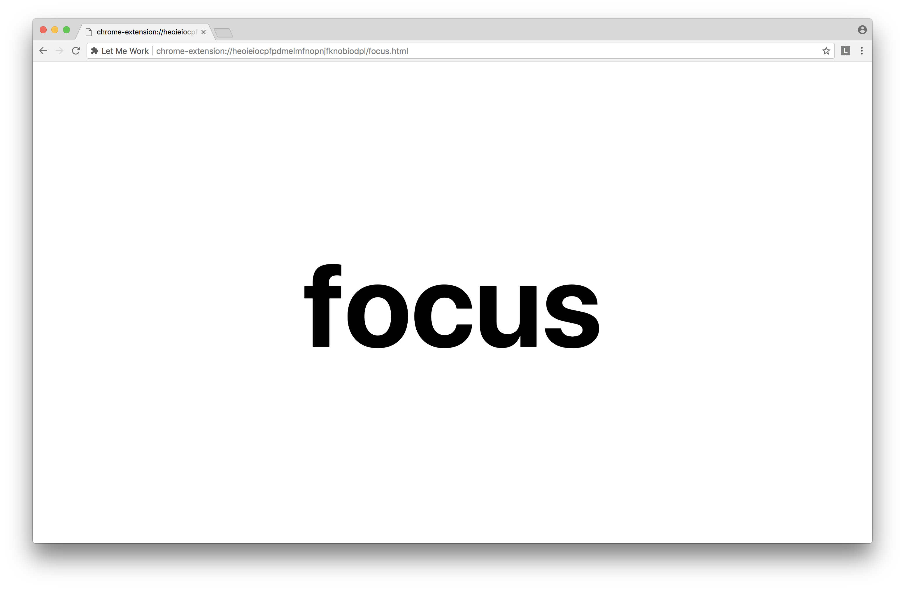

# Let Me Work

This is a Chrome extension.

You define a list of patterns. When you visit a website, the URL gets compared
against that list. If any pattern matches, you get redirected to a local page
that tells you to focus!

That's all.

## Why?

I use this to get out of the habit of visiting websites that are known to be
time sinks, e.g. Twitter.

## Installation

1. Clone this repo to your local drive.
1. Visit `chrome://extensions` in Chrome.
1. Check the `Developer mode` box.
1. Click `Load unpacked extension...` and choose the cloned repo.
